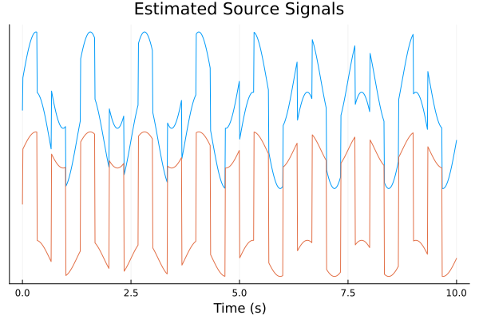
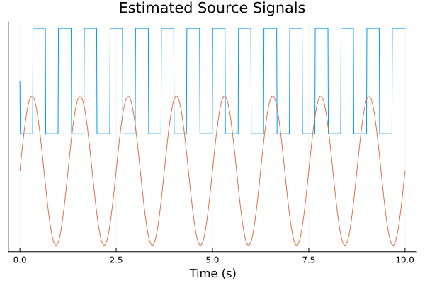
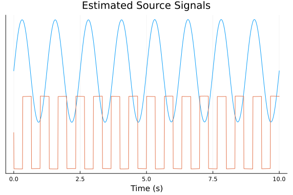
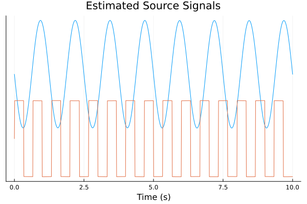

# Test Results

Each algorithm is tested upon the same minimal Data: a Sinvewave and a Squarewave mixed together.
 \

## JADE
The Jade algorithm has no issues recovering the original sources:
 \

## SHIBBS
Shibbs, as an iterative algorithm, needs multiple runs to find the original sources:
 \

## PICARD
The Picard algorithm, like Jade, recovers the original sources faithfully:
